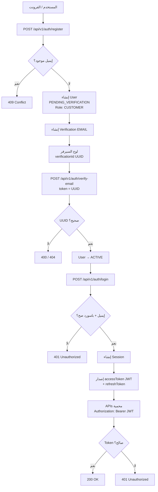
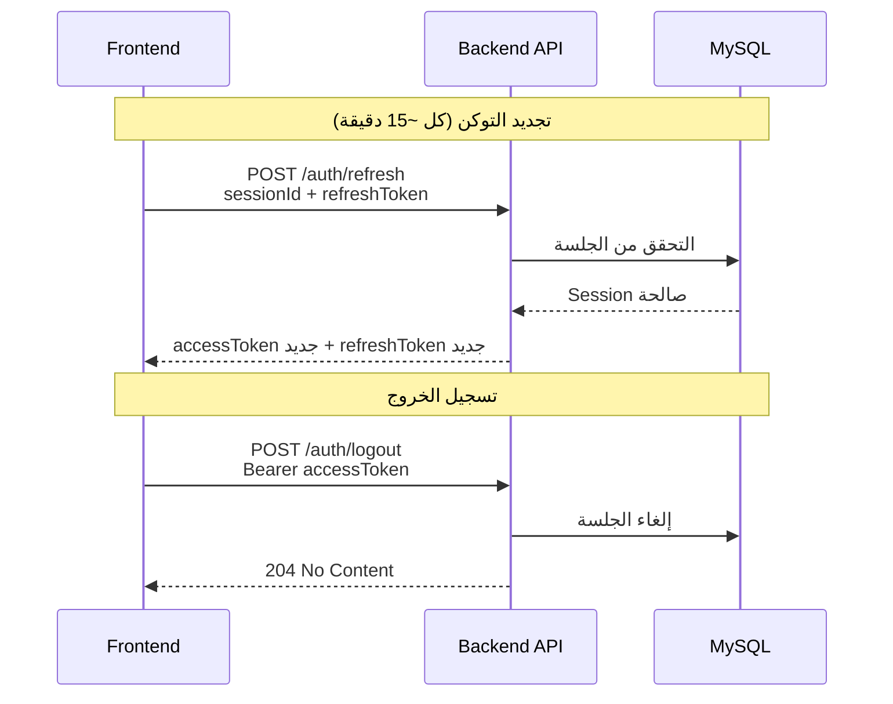
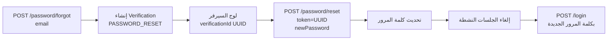
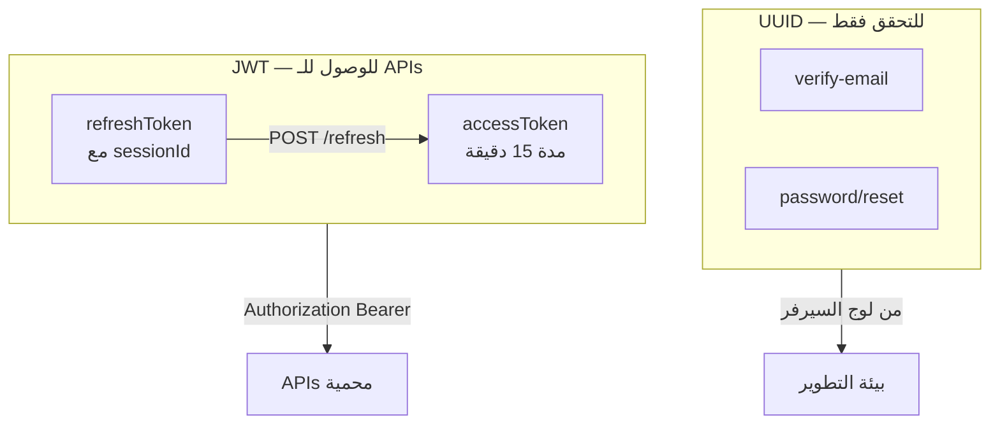
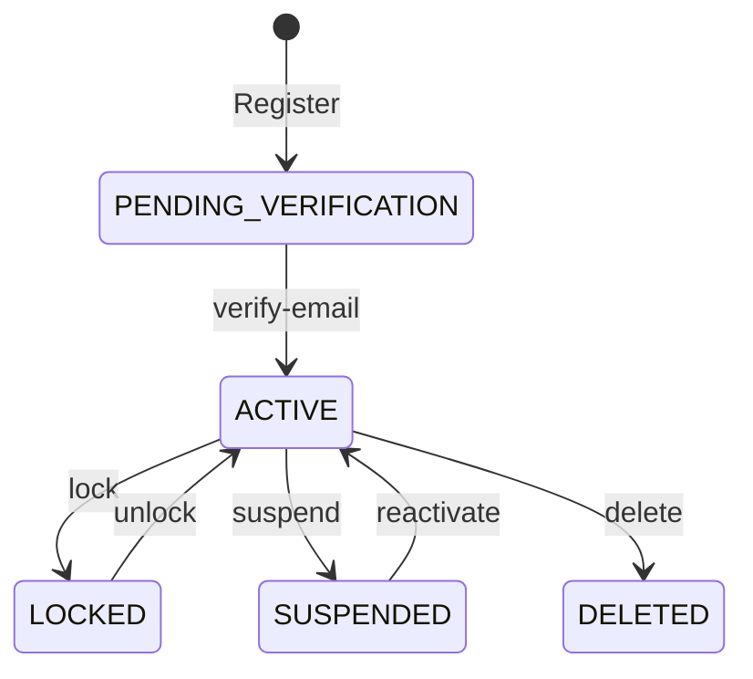
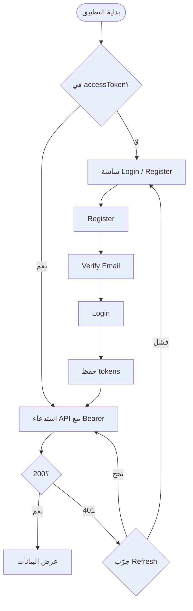

# Auth Flow — Takarub eSIM Platform

Base URL: `http://localhost:8080`  
Swagger: `http://localhost:8080/swagger-ui/index.html`

---

## 1. Main Flow (Register → Login → Protected APIs)



---

## 2. Refresh & Logout



---

## 3. Password Reset



---

## 4. Token Types



---

## 5. User Status States



---

## 6. Frontend Integration Flow



---

## API Reference

| Method | Endpoint | Auth | Description |
|--------|----------|------|-------------|
| POST | `/api/v1/auth/register` | Public | تسجيل حساب جديد |
| POST | `/api/v1/auth/verify-email` | Public | تفعيل الإيميل (`token` = UUID) |
| POST | `/api/v1/auth/login` | Public | تسجيل الدخول |
| POST | `/api/v1/auth/refresh` | Public | تجديد access token |
| POST | `/api/v1/auth/logout` | Bearer | تسجيل الخروج |
| POST | `/api/v1/auth/password/forgot` | Public | طلب إعادة تعيين كلمة المرور |
| POST | `/api/v1/auth/password/reset` | Public | تعيين كلمة مرور جديدة (`token` = UUID) |

---

## Request / Response Examples

### Register

```json
POST /api/v1/auth/register
{
  "email": "user@example.com",
  "password": "password123"
}
```

### Verify Email

```json
POST /api/v1/auth/verify-email
{
  "token": "712195ca-3f33-4e46-9145-d71f4f27271a"
}
```

> في بيئة التطوير: الـ `token` يظهر في لوج السيرفر:
> `Email verification notification ... verificationId=...`

### Login

```json
POST /api/v1/auth/login
{
  "email": "user@example.com",
  "password": "password123",
  "deviceName": "Web",
  "deviceType": "WEB",
  "ipAddress": "127.0.0.1",
  "userAgent": "Mozilla/5.0"
}
```

Response:

```json
{
  "userId": "...",
  "sessionId": "...",
  "accessToken": "...",
  "refreshToken": "...",
  "expiresAt": "..."
}
```

### Protected APIs

```
Authorization: Bearer <accessToken>
```

### Refresh

```json
POST /api/v1/auth/refresh
{
  "sessionId": "...",
  "refreshToken": "..."
}
```

### Password Forgot / Reset

```json
POST /api/v1/auth/password/forgot
{ "email": "user@example.com" }
```

```json
POST /api/v1/auth/password/reset
{
  "token": "<UUID from server log>",
  "newPassword": "newpassword123"
}
```

---

## Development Notes

1. لا يوجد إرسال إيميل حقيقي — كل `verificationId` يُسجَّل في console السيرفر.
2. `accessToken` ينتهي بعد **15 دقيقة** — استخدم `/refresh` أو أعد login.
3. Swagger لا يعرض زر **Authorize** حالياً — استخدم Postman أو أضف `Authorization` header في الفرونت.
4. التسجيل يعطي role **CUSTOMER** فقط.
