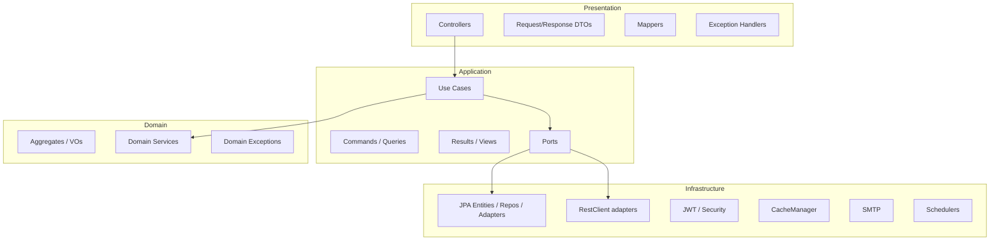
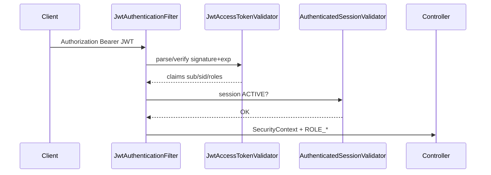
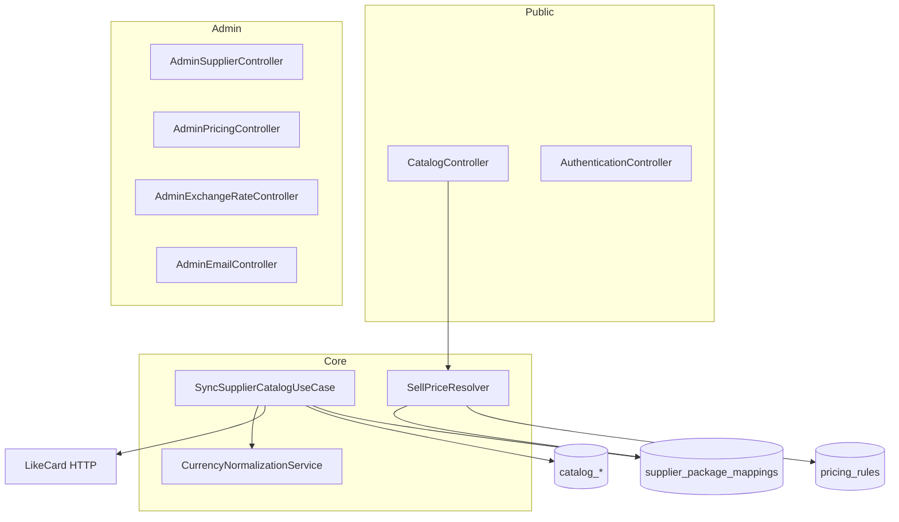

# 01 — System Architecture

## 1. What this system is

`takarub-esim` is a **modular monolith** for an eSIM marketplace:

- Customers browse a unified catalog (countries/regions → packages → priced USD sell price).
- Admins configure SMTP, supplier sync, exchange rates, and pricing rules.
- LikeCard is the only live supplier integration; multi-supplier cost comparison is prepared via USD-normalized costs.

**Entry point:** `com.takarub.esim.EsimApplication`

- `@SpringBootApplication` scans `com.takarub.esim`
- Excludes `UserDetailsServiceAutoConfiguration` (custom JWT auth)

## 2. Layering (Clean / Hexagonal per module)

**Rule of thumb:** Domain has no Spring annotations (except rare infrastructure bleed). Use cases are plain classes wired as `@Bean` in `*UseCaseConfig`. Controllers depend on use cases, not repositories.

## 3. Bounded contexts

| Module | Package root | Responsibility |
|--------|--------------|----------------|
| **identity** | `com.takarub.esim.identity` | Users, roles, sessions, JWT, verifications, SMTP admin, shared exception/id/time/security |
| **catalog** | `com.takarub.esim.catalog` | Countries/packages browse, FX rates, currency normalization service, catalog cache |
| **pricing** | `com.takarub.esim.pricing` | Sell-price rules (global % / package % / fixed), `SellPriceResolver` |
| **supplier** | `com.takarub.esim.supplier` | LikeCard sync, credentials, mappings, audit logs, sync jobs |

Shared cross-cutting types live under **`identity.shared`** (used by other modules).

## 4. Runtime stack

| Concern | Technology |
|---------|------------|
| Runtime | Java 21, Spring Boot 3.3.5 |
| HTTP | spring-webmvc |
| Security | spring-security + custom JWT filter |
| Persistence | Spring Data JPA + Hibernate `ddl-auto=validate` |
| Schema | Flyway MySQL V1–V14 |
| Cache | Spring Cache — ConcurrentMap (default) or Redis |
| Mail | spring-mail + DB-driven SMTP config |
| API docs | springdoc-openapi 2.6.0 |
| JWT | jjwt 0.12.6 HS256 |

## 5. Configuration map

### `application.yml`

| Key | Purpose | Risk if changed |
|-----|---------|-----------------|
| `spring.datasource.*` | MySQL connection | App won't start / wrong DB |
| `spring.jpa.hibernate.ddl-auto=validate` | Schema must match Flyway | Startup failure on drift |
| `spring.flyway.enabled` | Apply migrations | Data loss risk if disabled with dirty DB |
| `spring.data.redis.*` | Redis host/port | Only matters if redis cache enabled |
| `takarub.cache.redis-enabled` | Choose Redis vs in-memory cache | `true` without Redis → catalog/pricing failures |
| `identity.session-ttl` | Session lifetime | Security / UX |
| `identity.email-verification-ttl` | Email verify token lifetime | |
| `identity.password-reset-ttl` | Reset token lifetime | |
| `identity.mail.enabled` | Real SMTP vs log-only | Emails silently logged if false |
| `identity.smtp.encryption-*` | Decrypt SMTP passwords in DB | Wrong salt/password → cannot decrypt |
| `identity.jwt.*` | Access token signing | Invalidating all sessions if secret rotates |

### `application-local.yml` (gitignored)

Copied from `application-local.yml.example`. Holds local DB credentials and encryption secrets.

### Test `src/test/resources/application.yml`

H2 MySQL mode + Flyway; Redis autoconfig excluded; fixed test JWT/SMTP secrets.

## 6. Security architecture

### Path rules (`SecurityConfig`)

**permitAll:**

- `GET /actuator/health`
- Swagger `/swagger-ui/**`, `/v3/api-docs/**`
- Auth public: register, login, refresh, verify-email, password forgot/reset
- `GET /api/v1/catalog/**`

**authenticated JWT + active session:** everything else (including logout, users, all admin).

**ADMIN method security:** `@PreAuthorize("hasRole('ADMIN')")` on admin controllers and `GET /users/email/{email}`.

## 7. Caching architecture

| Cache name | Content | Key pattern |
|------------|---------|-------------|
| `catalog:countries` | Country list | `'all'` |
| `catalog:packages` | Package list | `'list:' + iso\|ALL` |
| `catalog:package-details` | One package | package UUID |
| `catalog:search` | Search page | hash of filters+page |

**Invalidation** (`CatalogCacheInvalidator.invalidateAll`): supplier sync success; pricing upsert/delete.

**Not invalidated today:** exchange-rate updates (sell prices may stale until TTL/other clear).

**Default:** in-memory (`takarub.cache.redis-enabled=false`).

## 8. Scheduling

| Scheduler | Cron | Behavior |
|-----------|------|----------|
| `CatalogSyncScheduler` | `0 0 */12 * * ?` | Always runs LikeCard sync |
| `SyncJobSchedulerService` | From `sync_jobs` table | Dynamic; LIKE_CARD seed disabled by default |

## 9. Error handling

| Handler | Scope | Behavior |
|---------|-------|----------|
| `GlobalExceptionHandler` | All | Maps shared exceptions → 401/403/404/409/400/422/500 |
| `CatalogExceptionHandler` | `CatalogController` | `PackageNotFoundException` → 404 |

Unhandled runtime (e.g. Redis down historically, `SupplierApiException`) → **500 INTERNAL_ERROR**.

## 10. What does NOT exist yet

- Order / cart / checkout
- Payment gateway
- Customer purchase of eSIM
- Second supplier adapter (ZATEXA / SUPPLIER_X enum only)
- Dockerfile / CI workflows
- Dual ID (BIGINT+UUID) on `catalog_packages` — still UUID string PK

## 11. High-level component diagram

