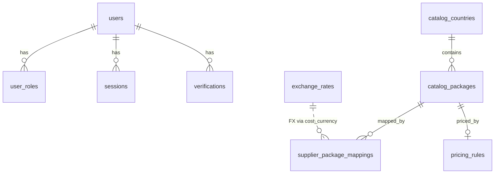

# 03 — Database Reference

**Engine:** MySQL (InnoDB, utf8mb4)  
**Owner:** Flyway only (`ddl-auto=validate`)  
**Migrations:** `src/main/resources/db/migration/V1` … `V14`

---

## ER overview

---

## Migration timeline

| Ver | Creates / alters |
|-----|------------------|
| V1 | `users` |
| V2 | `user_roles` |
| V3 | `sessions` |
| V4 | `verifications` |
| V5 | `supplier_credentials` |
| V6 | `catalog_countries`, `catalog_packages`, `supplier_package_mappings` |
| V7 | `supplier_likecard_products` |
| V8 | Widen ISO columns to VARCHAR(10) |
| V9 | `supplier_sync_audit_logs` |
| V10 | ISO VARCHAR(50); `location_type`; audit region counters |
| V11 | `sync_jobs` + LIKE_CARD seed disabled |
| V12 | `email_smtp_config` |
| V13 | `exchange_rates`; mapping `normalized_*` |
| V14 | `pricing_rules` |

---

## Table dictionary

### `users` (V1)
| Column | Type | Notes |
|--------|------|-------|
| id | VARCHAR(36) PK | UUID |
| email | VARCHAR UK | normalized |
| password_hash | VARCHAR | BCrypt |
| status | VARCHAR | PENDING_VERIFICATION/ACTIVE/LOCKED/SUSPENDED/DELETED |
| created_at, updated_at | DATETIME(6) | |

**Ops:** INSERT register; UPDATE verify/password/status; SELECT by id/email.

### `user_roles` (V2)
| Column | Notes |
|--------|-------|
| user_id + role | Composite PK; FK CASCADE to users |

**Ops:** INSERT on register (CUSTOMER); ElementCollection sync.

### `sessions` (V3)
| Column | Notes |
|--------|-------|
| id | UUID PK |
| user_id | FK |
| refresh_token | opaque UUID plaintext |
| status | ACTIVE/REVOKED/EXPIRED |
| device_* | embedded metadata |
| last_activity_at, expires_at | |

**Ops:** INSERT create; UPDATE rotate/revoke; SELECT by id / active by user.

### `verifications` (V4)
| Column | Notes |
|--------|-------|
| id | UUID PK (= API token) |
| user_id, type, status, expires_at | EMAIL_VERIFICATION / PASSWORD_RESET |

**Ops:** INSERT issue; UPDATE consume/cancel.

### `supplier_credentials` (V5)
Key/value config per `supplier_key` (LIKE_CARD: base_url, email, password, securityCode, deviceId, langId).

**Ops:** SELECT by supplier (no admin API in code for upsert — DB managed).

### `catalog_countries` (V6+V10)
| Column | Notes |
|--------|-------|
| id | VARCHAR(50) PK — ISO or region id |
| arabic_name, english_name, flag_image_url | |
| location_type | COUNTRY / REGION |

**Ops:** upsert via `ensureLocation` / placeholder create.

### `catalog_packages` (V6+V10)
| Column | Notes |
|--------|-------|
| id | VARCHAR(36) UUID PK (**public id**) |
| country_iso | FK → countries |
| data_amount, data_unit, duration_days | fingerprint |
| is_available | sync-driven |
| location_type | denormalized |

**Ops:** INSERT on new fingerprint; UPDATE availability; SELECT browse/search.

**No price columns.**

### `supplier_package_mappings` (V6+V13)
| Column | Notes |
|--------|-------|
| id | INT AI PK |
| catalog_package_id | FK UUID |
| supplier_key, remote_product_id | UNIQUE pair |
| cost_price, cost_currency | **original** supplier cost |
| normalized_cost_price, normalized_currency | **USD** comparable |
| is_in_stock | |

**Ops:** UPSERT in-stock on sync; UPDATE OOS; UPDATE normalized on FX change; SELECT MIN(normalized) for pricing.

### `supplier_likecard_products` (V7)
Raw LikeCard product snapshot + JSON payload for audit.

**Ops:** UPSERT by remote_product_id during sync.

### `supplier_sync_audit_logs` (V9+V10)
One row per sync attempt with counters and status STARTED/SUCCESS/FAILED/PARTIAL.

**Ops:** INSERT STARTED; UPDATE finish; SELECT paged admin.

### `sync_jobs` (V11)
| Column | Notes |
|--------|-------|
| id | BIGINT AI |
| supplier_name, cron_expression, enabled, last_run_time | |

Seed: LIKE_CARD every 6h, **enabled=false**.

### `email_smtp_config` (V12)
SMTP host/port/user/encrypted password/from/active flags.

**Ops:** SELECT active; UPSERT admin.

### `exchange_rates` (V13)
| Column | Notes |
|--------|-------|
| base_currency, target_currency | UNIQUE pair |
| rate | DECIMAL(18,8) — base × rate = target |
| updated_at | |

Seed: USD→USD=1, SAR→USD=0.2666.

### `pricing_rules` (V14)
| Column | Notes |
|--------|-------|
| scope | GLOBAL / PACKAGE |
| catalog_package_id | NULL for GLOBAL; UNIQUE for package |
| rule_type | PERCENTAGE / FIXED |
| percentage, fixed_price, currency, enabled, updated_at | |

---

## Query patterns by feature

### Catalog browse sellable package
1. SELECT available packages (+ country join)
2. For each: SELECT package rule; SELECT MIN(normalized_cost) WHERE in_stock
3. Compute sell price in memory
4. Drop if empty

### Sync mapping upsert
1. SELECT mapping by (supplier, remote_id)
2. INSERT or UPDATE costs + in_stock=true
3. Bulk UPDATE in_stock=false for missing remotes
4. UPDATE catalog_packages.is_available

### FX recalculation
`UPDATE supplier_package_mappings SET normalized_cost_price = ROUND(cost_price * :rate, 4), normalized_currency='USD' WHERE cost_currency=:base AND cost_currency <> 'USD'`

---

## Identity of catalog package

**Business key (natural):** `(country_iso, data_amount, data_unit, duration_days)`  
**Surrogate public key:** UUID string in `catalog_packages.id`  
**Internal mapping PK:** INT on `supplier_package_mappings.id`

Dual BIGINT+UUID on packages is **not** implemented yet.
