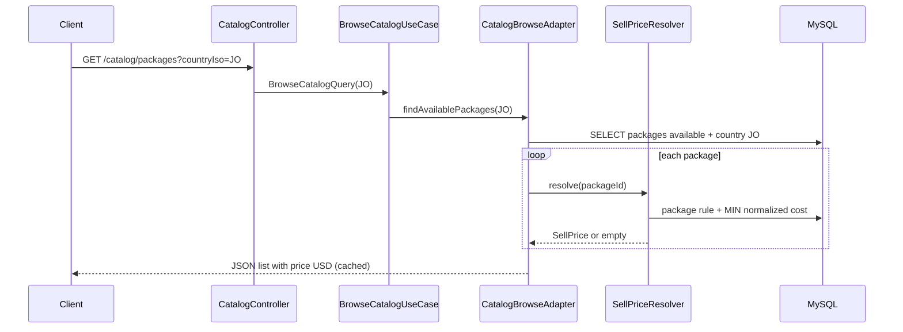
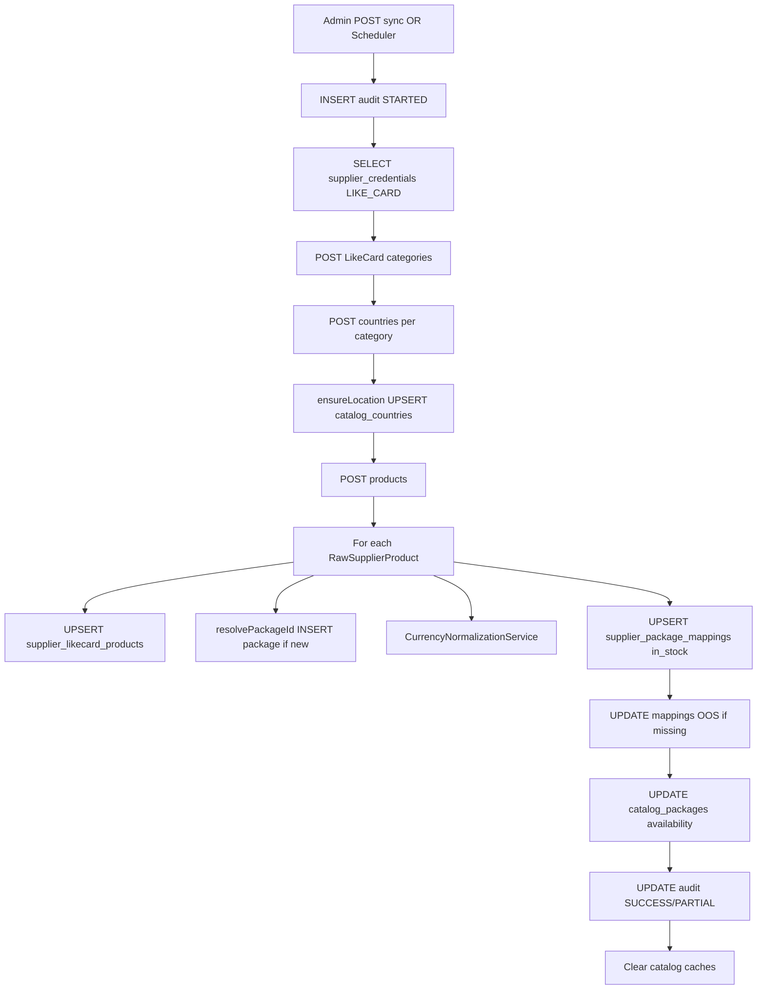

# 04 — Business Flows (Request → Database)

---

## Flow A — Customer browses packages for Jordan



**Final DB writes:** none (read-only).  
**Hide rule:** no FIXED and (no cost or no GLOBAL/% rule) → package omitted.

---

## Flow B — Admin sets package FIXED price

1. `PUT /admin/pricing/packages/{uuid}` + JWT ADMIN + `{type:FIXED, fixedPrice:19.99}`
2. `UpsertPackagePricingUseCase` validates fixedPrice > 0
3. `PricingRuleAdapter` UPSERT `pricing_rules` (PACKAGE/FIXED)
4. `CatalogCacheInvalidator.invalidateAll`
5. Next catalog GET recomputes; FIXED returns 19.99 without needing supplier cost

---

## Flow C — Admin sets package PERCENTAGE

1. Same endpoint with `{type:PERCENTAGE, percentage:5}`
2. Stores percentage; `fixed_price=NULL`
3. Catalog sell = `cheapestNormalizedCost * (1 + 5/100)` scale 2
4. If global was already 5%, visible price may not change

---

## Flow D — Supplier catalog sync (LikeCard)



**Unsupported supplier key:** audit FAILED + exception (HTTP 400 on admin).

---

## Flow E — Register → Verify → Login

1. **Register:** INSERT user PENDING + role CUSTOMER + verification EMAIL; send mail/log
2. **Verify:** consume verification; UPDATE user ACTIVE
3. **Login:** verify password; REVOKE prior sessions; INSERT session; issue JWT
4. **Authenticated call:** filter validates JWT + session ACTIVE

---

## Flow F — Password reset

1. Forgot: INSERT PASSWORD_RESET verification; notify
2. Reset: consume; UPDATE password_hash; REVOKE active session

---

## Flow G — Exchange rate update

1. PUT admin exchange-rates `{base:SAR, target:USD, rate:x}`
2. UPSERT `exchange_rates`
3. UPDATE mappings `normalized_*` where `cost_currency=SAR`
4. **Original `cost_*` untouched**
5. Catalog cache **not** cleared (stale sell prices possible until other invalidation)

---

## Flow H — Sell price resolution (core algorithm)

Executed per package on every uncached catalog read:

```
IF package FIXED rule enabled → return fixed USD
ELSE IF no in-stock normalized cost → empty (hide)
ELSE IF package PERCENTAGE → cost * (1 + %/100)
ELSE IF global PERCENTAGE → cost * (1 + %/100)
ELSE → empty (hide)
```

Cheapest cost = `MIN(normalized_cost_price)` among in-stock mappings for that package.
