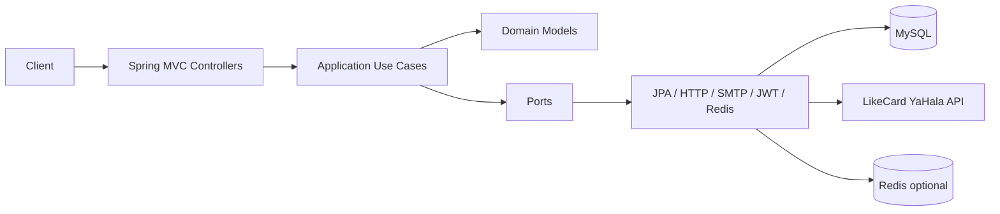

# Takarub eSIM — Complete Technical Reference

Generated from full codebase inspection of `takarub-esim` (Spring Boot 3.3.5 / Java 21 modular monolith).

| Metric | Count |
|--------|------:|
| Main Java sources | 297 |
| Test Java sources | 56 |
| Flyway migrations | 14 (V1–V14) |
| Bounded contexts | identity, catalog, pricing, supplier |

## Document map

| Doc | Contents |
|-----|----------|
| [01-system-architecture.md](./01-system-architecture.md) | Layers, modules, config, security, cache, Mermaid diagrams |
| [02-api-catalog.md](./02-api-catalog.md) | Every HTTP endpoint: method, auth, body, handlers, tables |
| [03-database.md](./03-database.md) | Every table, columns, FKs, migration history, query patterns |
| [04-business-flows.md](./04-business-flows.md) | End-to-end flows from request → DB |
| [05-identity-module.md](./05-identity-module.md) | Auth/users/sessions/SMTP — files, classes, use cases |
| [06-catalog-pricing-module.md](./06-catalog-pricing-module.md) | Catalog browse, FX, sell price — files, classes |
| [07-supplier-module.md](./07-supplier-module.md) | LikeCard sync, jobs, audit — files, classes |
| [08-file-inventory.md](./08-file-inventory.md) | Exhaustive file list with purpose, callers, risks |
| [09-critical-methods.md](./09-critical-methods.md) | Step-by-step for runtime-critical methods |

## Quick orientation

**Not in scope yet:** Order, Payment, fulfillment domains (planned next).

## How to read this set

1. Start with architecture + API catalog.
2. Use business flows for runtime behavior.
3. Use module docs for class/method detail.
4. Use file inventory when changing a specific path.
